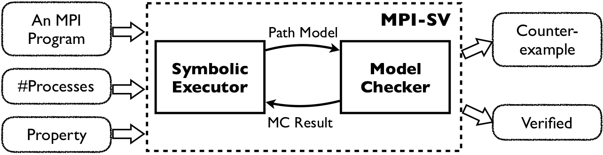

## **Introduction to MPI-SV**

## **Motivation**

Message Passing Interface (MPI) is the current *de facto* standard for developing the parallel applications in high-performance computing. Developing MPI applications is challenging due to the nature of MPI programming's complexities, such as non-determinism and non-blocking communications. Ensuring the correctness of MPI programs is highly demanded. 

Existing verification tools for MPI programs are mainly dynamic ones. These dynamic verification tools analyze the correctness of the MPI program under a specific input; hence, they may miss the bugs depending on program inputs. On the other hand, although there exist static verification tools (such as MPI-SPIN, TASS, and CIVL), these tools either need manual modeling or do not support the MPI programs with non-blocking operations, which are ubiquitous in real-world MPI programs. 

MPI-SV is a symbolic verifier for MPI C programs. MPI-SV covers the non-determinism caused by program inputs and supports the verification of the MPI programs with non-blocking and non-deterministic operations; besides, MPI-SV can verify LTL  properties. 

## **MPI-SV's Framework**

Insides MPI-SV, we have implemented our technique in [[1]](#jump1), which combines symbolic execution and model checking synergistically to enlarge the scope of verifiable properties and improve the scalability of verification. The high-level framework of MPI-SV is shown in the following figure.

The inputs of MPI-SV contain an MPI program, the property to verify, and the number of processes. At a high level, MPI-SV uses symbolic execution to reason the control and data flows of the MPI program. When getting a normally terminated program path, MPI-SV generates a CSP model representing the path's equivalent program behavior. Then, MPI-SV uses a CSP model checker to verify the path model. If the model does not satisfy the property, a counter-example is found and reported; if the model satisfies the property, MPI-SV prunes the program paths represented by the model and continues symbolic execution.

In a nutshell, MPI-SV synergistically integrates symbolic execution and model checking to verify MPI programs. Both symbolic execution and model checking complement to each other. Symbolic execution handles the complex features of the program to generate verifiable models for model checking; meanwhile, model checking improves the scalability and enlarges the scope of verifiable properties for pure symbolic execution. When MPI-SV finishes exploring the path space, and no violation is detected, MPI-SV reports that the program is verified to satisfy the property.

Please refer to [[1]](#jump1) for the details of MPI-SV's technique.

## **Key Features**

*   `Non-blocking MPI Programs`: MPI-SV is the first automatic static verification tool that supports non-blocking MPI programs. 

*   `Effectiveness and efficiency`: MPI-SV's synergy of symbolic execution and model checking improves the effectiveness and efficiency of the verification. Compared with the existing tools, MPI-SV can verify the properties in LTL. Efficiency is achieved by the path pruning in symbolic execution, which is enabled by the model checking.

*   `Generality`: MPI-SV's inside synergy framework is general and can be applied to other message-passing programs. Besides, as a tool, MPI-SV can also be extended to the MPI programs in other languages, such as C++ and FORTRAN.

* * *
[1]. Hengbiao Yu, Zhenbang Chen, Xianjin Fu, Ji Wang, Zhendong Su, Jun Sun, Chun Huang, Wei Dong. Symbolic Verification of Message Passing Interface Programs, in 42nd IEEE/ACM International Conference on Software Engineering (ICSE 2020), to appear.

* * *